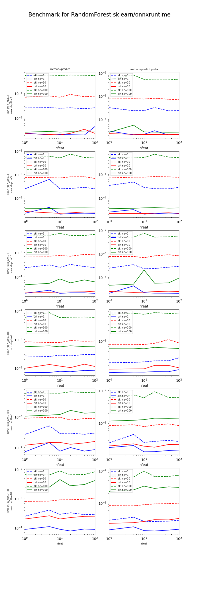

.. _l-onnxruntime-rf:

Prediction time scikit-learn / onnxruntime
==========================================

.. index:: onnxruntime, random forest

The following benchmark measure the prediction time between
:epkg:`scikit-learn` and :epkg:`onnxruntime` for different configurations
related to *one-off* prediction: predictions are computed
for one observations at a time which is the standard
scenario in a webservice.

.. contents::
    :local:

Code
++++

`bench_plot_onnxruntime_random_forest.py <https://github.com/sdpython/_benchmarks/blob/master/onnx/bench_plot_onnxruntime_random_forest.py>`_

Graphs
++++++

Raw results
+++++++++++

:download:`bench_plot_onnxruntime_random_forest.csv <../../onnx/results/bench_plot_onnxruntime_random_forest.csv>`

.. plot::

    import matplotlib.pyplot as plt
    import pandas
    name = "../../onnx/results/bench_plot_onnxruntime_random_forest.csv"
    df = pandas.read_csv(name)
    df['speedup'] = df['time_skl'] / df['time_ort']
    plt.close('all')
    fig, ax = plt.subplots(nrows=1, ncols=1, figsize=(10, 4))
    for color, method in zip('rgby', sorted(set(df.method))):
        subdf = df[df.method == method]
        subdf.plot(x="time_skl", y="speedup", logx=True, logy=True,
                   kind="scatter", ax=ax, label="d=%d" % degree,
                   c=color)
    ax.set_xlabel("Time(s) of 0.20.2\n.")
    ax.set_ylabel("Speed up compare to 0.20.2")
    ax.set_title("Acceleration / original time")
    ax.plot([df.time_skl.min(), df.time_skl.max()], [2, 2],
            "--", c="black", label="2x")
    ax.legend()
    plt.show()

:epkg:`onnxruntime` is always faster in that particular scenario.

.. runpython::
    :rst:
    :warningout: RuntimeWarning
    :showcode:

    from pyquickhelper.pandashelper import df2rst
    import pandas
    name = os.path.join(__WD__, "../../onnx/results/bench_plot_onnxruntime_random_forest.csv")
    df = pandas.read_csv(name)
    df['speedup'] = df['time_skl'] / df['time_ort']
    print(df2rst(df, number_format=4))

Benchmark code
++++++++++++++

.. literalinclude:: ../../onnx/bench_plot_onnxruntime_random_forest.py
    :language: python
