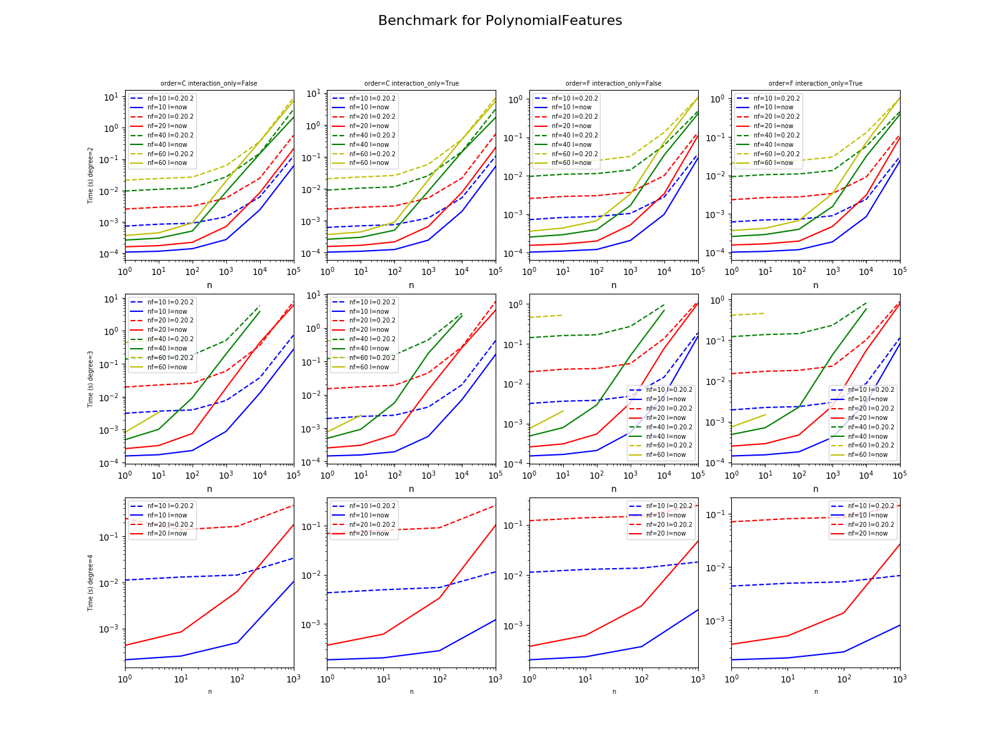
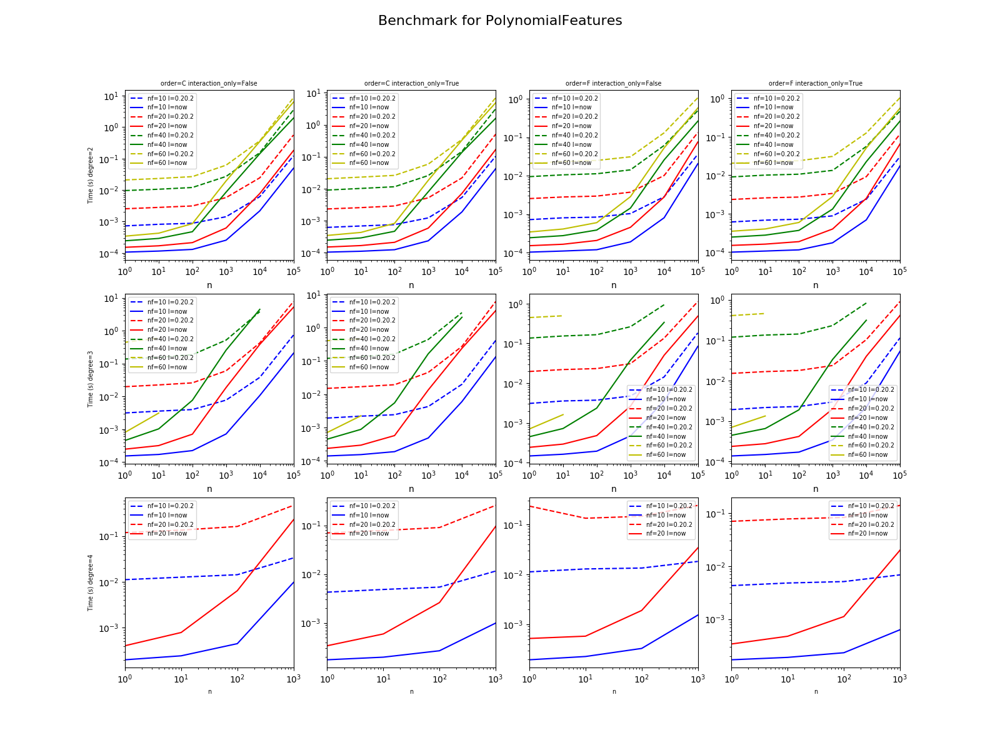
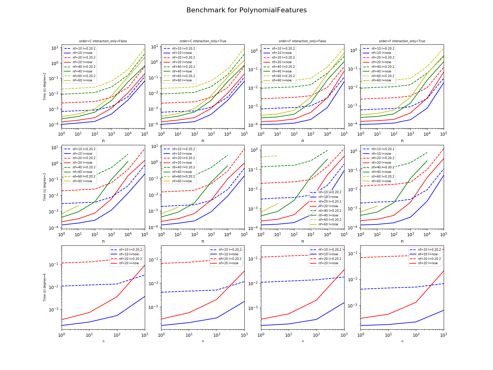

.. index:: polynomial features, scikit-learn

PR13290 - Faster Polynomial Features
====================================

.. contents::
    :local:

Intuition
+++++++++

The current implementation of :epkg:`PolynomialFeatures`
(0.20.2) uses a code based on combinations as follows:

::

    def combinations(iterable, r):
        # combinations('ABCD', 2) --> AB AC AD BC BD CD
        # combinations(range(4), 3) --> 012 013 023 123
        pool = tuple(iterable)
        n = len(pool)
        if r > n:
            return
        indices = list(range(r))
        yield tuple(pool[i] for i in indices)
        while True:
            for i in reversed(range(r)):
                if indices[i] != i + n - r:
                    break
            else:
                return
            indices[i] += 1
            for j in range(i+1, r):
                indices[j] = indices[j-1] + 1
            yield tuple(pool[i] for i in indices)

The current code for method *transform* uses independently computes
every feature:

::

    XP = np.empty((n_samples, self.n_output_features_), dtype=X.dtype)
    for i, comb in enumerate(combinations):
        XP[:, i] = X[:, comb].prod(1)

But it is possible to leverage broadcasting to reduce
the number of multiplication to do:

::

    def multiply(A, B, out):
        return numpy.multiply(A, B, out)

    XP[:, 0] = 1
    pos = 1
    n = X.shape[1]
    for d in range(0, self.poly_degree):
        if d == 0:
            XP[:, pos:pos + n] = X
            index = list(range(pos, pos + n))
            pos += n
            index.append(pos)
        else:
            new_index = []
            end = index[-1]
            for i in range(0, n):
                a = index[i]
                new_index.append(pos)
                new_pos = pos + end - a
                multiply(XP[:, a:end], X[:, i:i + 1], XP[:, pos:new_pos])
                pos = new_pos

            new_index.append(pos)
            index = new_index

Code
++++

`PR13290 <https://github.com/scikit-learn/scikit-learn/pull/13290>`_:
implements faster polynomial features for dense matrices.

Graphs
++++++

Raw results
+++++++++++

:download:`bench_polynomial_features.csv <../../scikit-learn/results/bench_polynomial_features.csv>`

.. plot::

    import matplotlib.pyplot as plt
    import pandas
    name = "../../scikit-learn/results/bench_polynomial_features.csv"
    df = pandas.read_csv(name)
    df['speedup'] = df['time_0_20_2'] / df['time_current']
    plt.close('all')
    plt.style.use('ggplot')
    fig, ax = plt.subplots(nrows=1, ncols=1, figsize=(10, 4))
    for color, degree in zip('rgby', sorted(set(df.degree))):
        subdf = df[df.degree == degree]
        subdf.plot(x="time_0_20_2", y="speedup", logx=True, logy=True,
                   kind="scatter", ax=ax, label="d=%d" % degree,
                   c=color)
    ax.set_xlabel("Time(s) of 0.20.2\n.")
    ax.set_ylabel("Speed up compare to 0.20.2")
    ax.set_title("Acceleration / original time")
    ax.plot([df.time_0_20_2.min(), df.time_0_20_2.max()], [2, 2],
            "--", c="black", label="2x")
    ax.legend()
    plt.show()

The new implementation is always better.

.. runpython::
    :rst:
    :warningout: RuntimeWarning
    :showcode:

    from pyquickhelper.pandashelper import df2rst
    import pandas
    name = os.path.join(__WD__, "../../scikit-learn/results/bench_polynomial_features.csv")
    df = pandas.read_csv(name)
    df['speedup'] = df['time_0_20_2'] / df['time_current']
    print(df2rst(df, number_format=4))

Benchmark code
++++++++++++++

.. literalinclude:: ../../scikit-learn/bench_plot_polynomial_features.py
    :language: python

Variances
+++++++++

Transpose if order=='C' and size < 10e7
^^^^^^^^^^^^^^^^^^^^^^^^^^^^^^^^^^^^^^^

:download:`bench_polynomial_features.csv <../../scikit-learn/results/bench_polynomial_features_transpose.csv>`

Never transpose
^^^^^^^^^^^^^^^

:download:`bench_polynomial_features_notranspose.csv <../../scikit-learn/results/bench_polynomial_features_notranspose.csv>`

