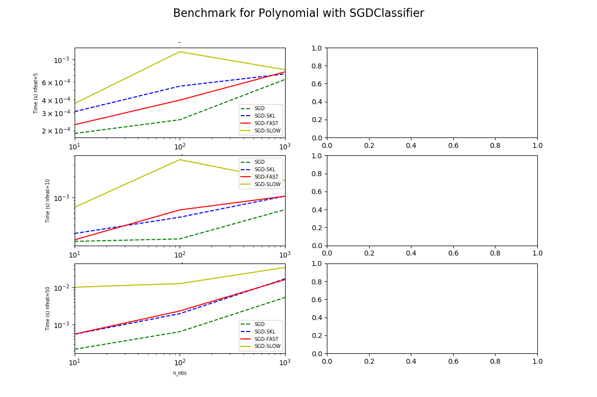

.. index:: polynomial features, scikit-learn, partial_fit

PR13290 - Faster Polynomial Features with partial_fit
=====================================================

This is another benchmark for :ref:`l-PR13290`.
It looks into a scenario where a pipeline including
polynomial features is continuously updated with
method `partial_fit <https://scikit-learn.org/stable/modules/generated/sklearn.linear_model.SGDClassifier.html#sklearn.linear_model.SGDClassifier.partial_fit>`_.

.. contents::
    :local:

Graphs
++++++

Raw results
+++++++++++

:download:`bench_polynomial_features.csv <../../scikit-learn/results/bench_plot_polynomial_features_partial_fit.csv>`

.. plot::

    import matplotlib.pyplot as plt
    import pandas
    name = "../../scikit-learn/results/bench_plot_polynomial_features_partial_fit.csv"
    df = pandas.read_csv(name)
    df['speedup'] = df['time_pipe_slow'] / df['time_pipe_fast']
    plt.close('all')
    plt.style.use('ggplot')
    fig, ax = plt.subplots(nrows=1, ncols=1, figsize=(10, 4))
    for color, nfeat in zip('rgby', sorted(set(df.nfeat))):
        subdf = df[df.nfeat == nfeat]
        subdf.plot(x="time_pipe_slow", y="speedup", logx=True, logy=True,
                   kind="scatter", ax=ax, label="nf=%d" % nfeat,
                   c=color)
    ax.set_xlabel("Time(s) of 0.20.2\n.")
    ax.set_ylabel("Speed up compare to 0.20.2")
    ax.set_title("Acceleration / original time")
    ax.plot([df.time_pipe_slow.min(), df.time_pipe_fast.max()], [2, 2],
            "--", c="black", label="2x")
    ax.legend()
    plt.show()

The new implementation is always better.

.. runpython::
    :rst:
    :warningout: RuntimeWarning
    :showcode:

    from pyquickhelper.pandashelper import df2rst
    import pandas
    name = os.path.join(__WD__, "../../scikit-learn/results/bench_plot_polynomial_features_partial_fit.csv")
    df = pandas.read_csv(name)
    df['speedup'] = df['time_pipe_slow'] / df['time_pipe_fast']
    print(df2rst(df, number_format=4))

Benchmark code
++++++++++++++

.. literalinclude:: ../../scikit-learn/bench_plot_polynomial_features_partial_fit.py
    :language: python
